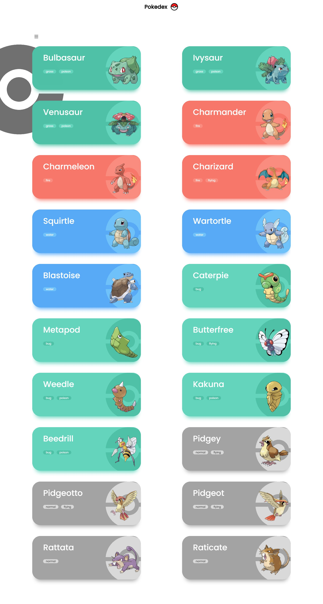
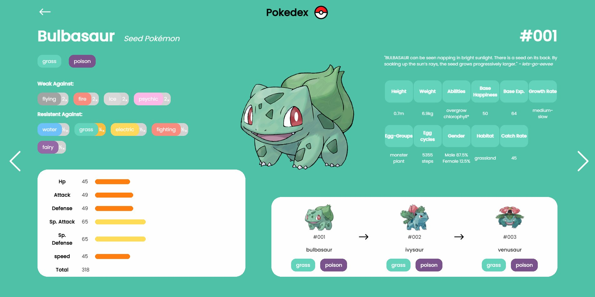

# Pokedex 

This project is a pokedex app to see all the basic info about pokemon!

## Overview 

This app was made as a side project to develop my programing skills and to create something fun and useful. It gives the list of all pokemons known with some filters to be able to search better. 

It gives some useful information about each pokemon, like it´s evolution chain, weakness, base stats and some general info.

### Screenshot

+ Home 

+ List 

+ Pokemon 

### Links

- Live site URL: [https://pokedexer.netlify.app](https://pokedexer.netlify.app)

### Building Processs

I used create react app to start the project, and then started creating the home page, initialy I had a plan to add some cool 3d objects to interact with in the home page, turns out it didn't work as planed lol. So I sticked with the idea of adding just one simple button but with a rather nice animation. 

Then I started creating the pokemon list page fetching data from the [poke APi](https://pokeapi.co), I added a pokeBall background that spins as you scroll down, and created one card for each pokemon. When you click the card you are redirected to the pokemon page, with all the basic info of that pokemon. 

Later on I kept adding some aditional features, like an filter to the pokemon list, where you can filter the pokemon by type and generation, and a modal for the evolution chain that displays the evolution triggers.

### Built with

- [React](https://reactjs.org)
- [Sass](https://sass-lang.com/guide)
- [React-icons](https://react-icons.github.io/react-icons/)
- [Poke Api](https://pokeapi.co)

### Main Concepts I learned

- React Router
- Asynchronous JS - promises
- Creating React custom Hooks
- React Forward Ref
- Axios
- CSS Animations

### Improvements to be made 

There is still a lot to be done in this project. I would really like to make it more performatic, as it is quite slow sometimes, add some kind of serchBox to find pokemon by name, add habilities and TMs to the pokemon page, create an backend to be able to generate users where this users could have some kind of favourite pokemon list and could create a team which they can see the type weakness of the hole team.
